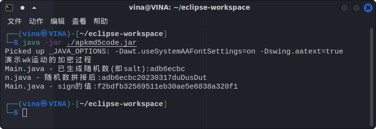

# wkyd
wk运动app的抓包笔记与利用思路

# 抓包记录
[抓包笔记](./抓包记录)

# apk反编译及salt和sign算法
[apk反编译分析笔记](./apk反编译分析笔记.md)

# 笔记

## salt和sign  
- salt和sign已解密,使用UUID随机字符的前8位为salt,加上当前日期加duDusDut再md5转小写字母为sign,可使用[演示程序](./apkmd5code/apkmd5code.jar)来生成,详见[apk反编译分析笔记](./apk反编译分析笔记.md)  

- salt和sign在未登录前的检查更新中就已经可以生成,并且通过替换学号,相同的salt和sign仍然生效推测,这两值的原始密文应该是固定的,与帐号和密码无关;salt和sign有有效时长,较长时候后会失效; 
- 使用有效的salt和sign值,通过修改学号可操作指定学号的信息

## 跑步
- 跑步前一定要先查看规则,让规则加载出来,这样跑步时的成绩才是有效的,否则会一直成绩无效  
- 跑步时不会向学校服务器发送数据,所有数据在按下提交按钮后提交,这份数据可重复使用且通过修改学号可帮该学号完成跑步  

## web
 - [web网页](./wkyd)  
 - 演示网站https://mexvina.top
